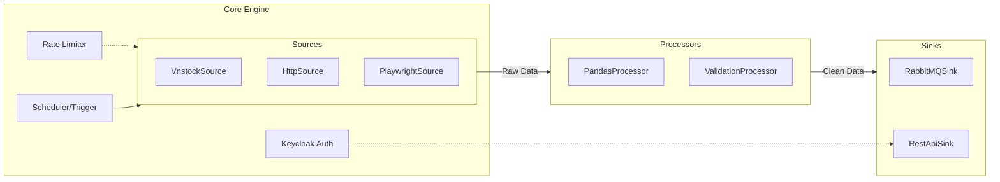

# Kế Hoạch Triển Khai Microservice: DataCollector

## Bối Cảnh & Mục Tiêu
`DataCollector` là một microservice độc lập chịu trách nhiệm thu thập dữ liệu từ nhiều nguồn khác nhau (vnstock, web scraping, external APIs), tiền xử lý (làm sạch, định dạng), và phân phối dữ liệu đó đến các service khác (như `StockTracker.API`) thông qua nhiều kênh (Message Queue, REST API, v.v.).

## 1. Kiến Trúc Cốt Lõi (ETL Pipeline Pattern)

Hệ thống được thiết kế theo mô hình **Pipeline** (Đường ống dữ liệu) bao gồm 3 thành phần chính tách biệt hoàn toàn để dễ dàng mở rộng (Open/Closed Principle):

1. **Source (Extractor)**: Chịu trách nhiệm lấy dữ liệu.
2. **Processor (Transformer)**: Chịu trách nhiệm tiền xử lý.
3. **Sink (Loader)**: Chịu trách nhiệm gửi dữ liệu đi.



## 2. Tích Hợp Dữ Liệu `vnstock` & Xử Lý (Data Mapping)

Do AI Agent khi code service này sẽ không có context về API đích (`StockTracker.API`), mọi Processor BẮT BUỘC phải transform dữ liệu raw thành các cấu trúc JSON tĩnh (Pydantic Schemas) được định nghĩa sẵn dưới đây:

### 2.1. Industry (Ngành nghề)
- **Nguồn vnstock**: Hàm `listing.industries_icb(source='VCI')`.
- **DataProcessor**: Xoá bỏ các cột thừa, loại bỏ null, map tên cột.
- **Output JSON Schema** (Bắt buộc phải tuân thủ để đẩy vào Sink):
  ```json
  {
    "code": "string (ví dụ: '8000', tối đa 20 ký tự)",
    "name": "string (ví dụ: 'Tài chính', tối đa 255 ký tự)",
    "level": "integer (ví dụ: 1)"
  }
  ```

### 2.2. Stock (Cổ phiếu)
- **Nguồn vnstock**: Hàm `listing.all_symbols(source='VCI')`.
- **Xử lý Foreign Key (industry_ids)**: vnstock chỉ trả về ICB code của ngành. Nhưng hệ thống API đích yêu cầu ID (integer) của DB. 
  - **Quy trình bắt buộc của Pipeline**: Trước khi process Stocks, Pipeline phải gọi API `GET /api/industries/all` của `StockTracker.API` để lấy danh sách ngành nghề hiện có, sau đó tạo một mapping dictionary (`code` -> `id`). 
  - Dùng dictionary này để map ICB code thu được từ vnstock sang list các số nguyên (`industry_ids`).
- **DataProcessor**: Chuẩn hoá `exchange` (HOSE, HNX, UPCOM) và `type` (STOCK, ETF, FUND).
- **Output JSON Schema**:
  ```json
  {
    "symbol": "string (ví dụ: 'VCB', tối đa 20 ký tự)",
    "name": "string (ví dụ: 'Ngân hàng TMCP Ngoại thương VN')",
    "short_name": "string hoặc null",
    "exchange": "string (HOSE, HNX, UPCOM)",
    "type": "string (STOCK, ETF...)",
    "industry_ids": [1, 2] // List integer ID lấy từ mapping step ở trên
  }
  ```

### 2.3. Market Index (Chỉ số thị trường)
- **Nguồn vnstock**: `listing.indices_by_group(source='VCI')` và thành phần rổ chỉ số (VN30, HNX30...).
- **Xử lý Foreign Key (stock_ids)**: Tương tự như trên, Pipeline phải gọi `GET /api/stocks/all` để lấy dictionary mapping `symbol` -> `id` nhằm phân giải danh sách cổ phiếu trong rổ chỉ số thành `stock_ids` dạng số nguyên.
- **Output JSON Schema**:
  ```json
  {
    "symbol": "string (ví dụ: 'VN30')",
    "name": "string",
    "description": "string hoặc null",
    "group": "string hoặc null",
    "stock_ids": [15, 20, 89] // List integer ID lấy từ mapping
  }
  ```

### 2.4. Company Fundamentals (Dữ Liệu Hồ Sơ Công Ty)
- **Bao gồm**: Company Profile, Shareholder, Officer, Affiliation, Event, News.
- **Nguồn vnstock**: Các hàm thuộc class `Company` (ví dụ: `overview()`, `shareholders()`, `officers()`, `subsidiaries()`, `events()`, `news()`).
- **Logic Pipeline**:
  - Tương tự như Index, Pipeline cần gọi API lấy danh sách `stock` (gồm ID và Symbol) từ `StockTracker.API` (lưu vào dictionary).
  - Lặp qua từng cổ phiếu, gọi API vnstock tương ứng, transform dữ liệu và gửi qua `RestApiSink` tới các endpoint đồng bộ chuyên dụng (Sync Endpoints).
- **Target API Endpoints**:
  - `PUT /api/v1/stocks/{stock_id}/profile/sync`
  - `PUT /api/v1/stocks/{stock_id}/shareholders/sync`
  - `PUT /api/v1/stocks/{stock_id}/officers/sync`
  - `PUT /api/v1/stocks/{stock_id}/affiliations/sync`
  - `PUT /api/v1/stocks/{stock_id}/events/sync`
  - `PUT /api/v1/stocks/{stock_id}/news/sync`
- **Output JSON Schema (ví dụ cho Shareholder)**:
  ```json
  {
    "stock_id": 1,
    "records": [
      {
        "name": "Nguyễn Văn A",
        "quantity": 1500000,
        "ownership_percent": 5.2
      }
    ]
  }
  ```

### 2.5. Market Data (Lịch Sử Giá & Khớp Lệnh)
- **Bao gồm**: Stock Price History (OHLCV) và Stock Intraday.
- **Nguồn vnstock**: `Quote(...).history()` và `Quote(...).intraday()`.
- **Đặc thù**: Volume dữ liệu cực lớn (đặc biệt là Intraday). Yêu cầu bắt buộc phải sử dụng **`RabbitMQSink`**, KHÔNG dùng REST API.
- **Chunking (Chia nhỏ dữ liệu)**: DataProcessor cần chia nhỏ danh sách (ví dụ 500 records/message) trước khi chuyển qua Sink để tránh Message Body quá lớn.
- **Output JSON Schema & Routing**:
  - **Stock Price History** (Routing Key: `stock_price_history.sync`):
    ```json
    {
      "stock_id": 1,
      "interval": "1D", // Giá trị từ Enum: 1m, 5m, 15m, 30m, 1h, 1D, 1W, 1M
      "records": [
        {
          "time": "2026-05-08T00:00:00Z",
          "open": 15000, "high": 15500, "low": 14900, "close": 15300, "volume": 2500000,
          "stock_id": 1
        }
      ]
    }
    ```
  - **Stock Intraday** (Routing Key: `stock_intraday.sync`):
    ```json
    {
      "stock_id": 1,
      "records": [
        {
          "time": "2026-05-09T10:15:23Z",
          "price": 15200, "volume": 5000,
          "match_type": "BUY", // BUY hoặc SELL
          "data_source_id": "vci_trade_12345",
          "stock_id": 1
        }
      ]
    }
    ```

## 3. Tích Hợp Keycloak (Service-to-Service Auth)

Vì `DataCollector` phải giao tiếp với `StockTracker.API` (một service được bảo vệ bởi Keycloak), chúng ta sẽ áp dụng pattern **Machine-to-Machine (M2M)** sử dụng luồng **Client Credentials Grant**.

### Quy trình tương tác (Best Practices)

1. **Khởi tạo Service Account**:
   - Trên Keycloak, tạo một Client riêng cho DataCollector (vd: `data-collector-service`).
   - Bật tính năng **Service Accounts Enabled** và **Client authentication** (On).
   - Gán Role phù hợp (ví dụ: `system_admin` hoặc các role có quyền `write` data) cho Service Account này.

2. **Quản lý Token (Bên trong DataCollector)**:
   - Viết một class `KeycloakAuthManager`.
   - Khi `RestApiSink` chuẩn bị gửi data, nó sẽ gọi Manager này lấy Access Token.
   - Manager sẽ gọi API `/protocol/openid-connect/token` của Keycloak bằng `client_id` và `client_secret` để lấy token.
   - **Caching**: Token (JWT) có thời hạn (vd 5 phút). Manager BẮT BUỘC phải cache token này trên memory (RAM) hoặc Redis cho đến khi gần hết hạn mới xin cấp lại, tuyệt đối KHÔNG xin cấp token mới cho mỗi request.

3. **Gửi Request**:
   - Đính kèm token vào header: `Authorization: Bearer <access_token>`.
   - API đích (`StockTracker.API`) sẽ tự động xác thực JWT này qua bộ public key của Keycloak mà không cần gọi ngược lại Keycloak, đảm bảo hiệu suất cực cao.

## 4. Hướng Dẫn Setup Môi Trường (Dev Environment)

Để đảm bảo chất lượng code và tính đồng nhất với dự án `StockTracker.API`, Repository này sẽ sử dụng chung bộ công cụ (toolchain) cực nhanh dựa trên Rust:

1. **Package & Environment Manager**: Dùng **`uv`**.
   - Khởi tạo project: `uv init`
   - Cài đặt dependency: `uv add fastapi pydantic structlog vnstock httpx ...`
   - Cài đặt dev dependency: `uv add --dev ruff pyright pytest pytest-asyncio`
   - Đồng bộ môi trường: `uv sync`
   - Chạy lệnh: `uv run <command>` (thay vì kích hoạt venv thủ công).

2. **Linter & Formatter**: Dùng **`ruff`**.
   - Cấu hình file `pyproject.toml` tương tự API đích (giới hạn dòng 120 ký tự, sắp xếp imports tự động).
   - Format code: `uv run ruff format .`
   - Kiểm tra lỗi: `uv run ruff check .` (có thể dùng `--fix` để tự động sửa lỗi import).

3. **Type Checking**: Dùng **`pyright`**.
   - Yêu cầu khai báo kiểu tĩnh (static typing) cho 100% các hàm.
   - Chạy kiểm tra: `uv run pyright`

4. **Testing Framework**: Dùng **`pytest`**.
   - Tổ chức trong thư mục `tests/`.
   - Cần cấu hình `pytest-asyncio` để test các pipeline bất đồng bộ.
   - Lệnh chạy: `uv run pytest`

## 5. Các Yêu Cầu Kỹ Thuật Bắt Buộc Khác

1. **Repository Độc Lập**: Microservice này được phát triển trên Git Repository riêng biệt.
2. **Multiple Sinks**: Hỗ trợ RabbitMQ (topic exchange) và REST API (webhook với Keycloak Token).
3. **Rate Limiting**: Cơ chế Token Bucket cho phép cấu hình giới hạn số request / giây / phút cho từng nguồn (tránh bị block IP).
4. **Resilience**: Tự động thử lại (Retry) sử dụng thư viện `tenacity`, Timeout control.
5. **Scheduling**: Lên lịch thu thập định kỳ sử dụng `APScheduler`.

## 6. Cấu Trúc Thư Mục Chuẩn (AI Agent Context)

```text
StockTracker.DataCollector/
├── core/                   # Cấu hình, Logger, Exceptions
│   ├── config.py           # Định nghĩa Client ID/Secret
│   ├── logger.py
│   └── rate_limiter.py
├── engine/                 # Logic chạy Pipeline & Resilience
│   ├── pipeline.py
│   ├── scheduler.py
│   ├── retry.py
│   └── keycloak_auth.py    # Quản lý & Cache Access Token
├── interfaces/             
│   ├── base_source.py
│   ├── base_processor.py
│   └── base_sink.py
├── pipelines/              # Các Job hoàn chỉnh (vd: VnstockListingPipeline)
├── plugins/                # Nơi implement thực tế
│   ├── sources/
│   │   ├── vnstock_source.py
│   │   └── playwright_source.py
│   ├── processors/
│   │   └── pandas_processor.py
│   └── sinks/
│       ├── rabbitmq_sink.py
│       └── rest_api_sink.py
├── schemas/                # Khai báo các Pydantic models dựa trên JSON Schema ở phần 2
└── main.py                 # FastAPI app
```

## 7. Sổ Tay Quy Tắc Dành Cho AI Agent (Agent Rules)

1. **Quy tắc JSON Schema & Mapping**: Agent PHẢI tạo Pydantic Models dựa CHÍNH XÁC vào các khối cấu trúc JSON được định nghĩa ở `Phần 2`. Đối với việc phân giải khóa ngoại (như `industry_ids`, `stock_ids`), Agent PHẢI implement logic gọi API GET (có xác thực qua Keycloak) đến hệ thống đích để tạo local map trước khi xử lý dữ liệu.
2. **Quy tắc Công Cụ (Toolchain Rule)**: Mọi thao tác chạy app, linting, format, và type-check ĐỀU PHẢI dùng thông qua `uv run` (ví dụ: `uv run ruff format .`). Code trước khi commit phải xanh 100% khi chạy `ruff check` và `pyright`.
3. **Quy tắc Kiến Trúc Plugin**: KHÔNG ĐƯỢC sửa đổi code trong `core/` hoặc `engine/` khi thêm tính năng thu thập mới. Tạo file mới trong thư mục `plugins/`.
4. **Quy tắc Rate Limiting**: Mọi network call ra bên ngoài phải đi qua `await self.rate_limiter.acquire()`.
5. **Quy tắc Authentication**: `RestApiSink` luôn phải sử dụng `KeycloakAuthManager` để lấy cached Bearer token.
6. **Quy tắc Xử lý ngoại lệ**: Bắt và log toàn bộ lỗi ở tầng `PipelineEngine` bằng `structlog` kèm context. Tuyệt đối không dùng `print()`.
7. **Quy tắc Bất đồng bộ**: Toàn bộ pipeline flow sử dụng `async/await`. Nếu dùng thư viện đồng bộ (`pandas`, `vnstock`), phải đẩy vào thread pool thông qua `asyncio.to_thread()`.
