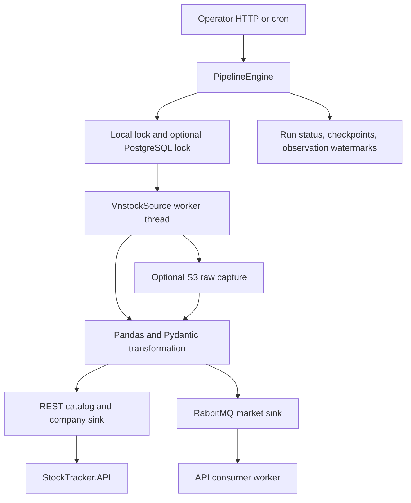
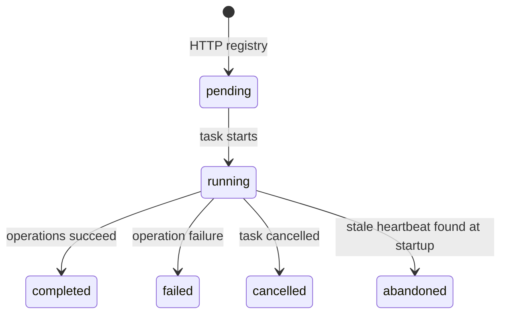

# Collector architecture

Source baseline: `c157150`, reviewed 2026-09-05.

## Responsibility and layout

The collector extracts provider data, optionally archives the extracted response, transforms it into typed payloads, and delivers it. It owns `collector.pipeline_runs`, `pipeline_steps`, `watermarks`, `raw_objects`, and `collector.alembic_version`. The API owns canonical stock/company/market tables.

| Location | Responsibility |
| --- | --- |
| `app/main.py` | Lifespan, dependency construction, health, job/trigger routes, operator auth |
| `app/engine/pipeline.py` | Exclusion, run context, step status, heartbeat, outcomes |
| `app/engine/job_registry.py` | In-process submission/tasks and bounded terminal history |
| `app/engine/scheduler.py` | APScheduler cron setup |
| `app/engine/keycloak_auth.py` | Client-credentials token cache and token introspection |
| `app/engine/stocktracker_api.py` | API industry and stock ID lookup |
| `app/engine/retry.py` | Selected HTTP network-error retries |
| `app/plugins/sources/vnstock_source.py` | Lazy SDK import, thread isolation, extraction validation |
| `app/plugins/processors` | Column mapping, identifiers, cleanup, chunking |
| `app/plugins/sinks` | REST and RabbitMQ delivery |
| `app/pipelines` | Listing, company and market workflows |
| `app/schemas` | Transport models independent of the API package |
| `app/control`, `app/archive` | PostgreSQL operational state and S3 capture/load |
| `app/core` | Settings, rate limits, errors and logging |
| `alembic` | Collector schema history |

## Pipeline workflows

Listing (`vnstock_listing`) extracts VCI ICB industries and POSTs them to API. It fetches the resulting industry ID map, transforms the selected provider's listings and POSTs stocks. It then fetches stock IDs, builds supported index baskets, checks that every constituent resolves, and POSTs index metadata/memberships. Checkpoints are `industries.sync`, `stocks.sync`, and `market_indices.sync`. Reference maps are reloaded even when earlier steps are skipped. Failure aborts this pipeline.

Company (`vnstock_company`) selects STOCK assets and runs profile, shareholders, officers, affiliations, events and news sequentially per symbol. Checkpoints are `<stream>:<symbol>`, such as `shareholders:FPT`. It rejects empty source snapshots and collection transformations that drop rows. Each failure is counted while unrelated operations continue; any failure makes the final run failed. Shareholders/officers/affiliations reconcile snapshots in API; events/news retain historical rows. The six operations are not one atomic transaction.

Market (`vnstock_market_data`) requires RabbitMQ and selects STOCK/ETF assets. For each stock it fetches history and recent trades, transforms them into chunks (default 500), and publishes each chunk. Checkpoints are `price_history:<symbol>` and `intraday:<symbol>`. A count/time/state watermark is written after all publishes for that operation. Other stocks continue after failures, but the final run fails if any operation failed.

Publication success does not wait for consumer persistence. A completed market step can still have queued or dead-lettered messages. Watermarks record observations/publication, not acknowledged database positions; source history fetches do not read them as cursors.

## Jobs, locks, and resume

HTTP submission returns 202 with an in-memory pending job ID. JobRegistry schedules an asyncio task, marks it running and calls the engine. Same-process pending/running duplicates produce 409. The optional PostgreSQL store adds a session advisory lock for each pipeline name. A competing process can receive 202 and then fail when it tries to acquire that lock.

Durable `start_run` inserts a running record after lock acquisition. Pending submissions are not durable. Scheduled runs call the engine directly and have no HTTP registry job. HTTP job lookup first checks the registry and then the durable store.

Heartbeat defaults to 30 seconds. Startup marks running records older than the stale threshold abandoned; recovery is not periodic. Early restart can strand younger interrupted records [C05](review.md#c05).

Resume creates a new run referencing a failed/cancelled/abandoned parent from the same pipeline. Only the parent's completed steps are skipped. Skipped steps are stored as skipped and are lost from the next resume's completed set [C03](review.md#c03). Resume uses current settings and current provider responses; it is not a frozen replay of the old run.

## Raw archive

Capture runs after extraction returns and before delivery. DataFrames use pandas table JSON, Series become list JSON, and other supported payloads use JSON. Metadata records pipeline/run/operation/source/schema version/capture time/parameters/state. The envelope is checksummed before gzip and uploaded under a unique run/date/capture key. If configured, the control store indexes it after upload.

Upload and indexing are separate writes: indexing failure may leave an orphan object. Unique keys provide append-style capture, but the deployment does not configure S3 Object Lock. Errors raised before extraction returns are not archived.

`RawArchive.load` decompresses, optionally validates a provided checksum, and reconstructs payload types. There is no HTTP replay endpoint or automatic re-ingestion workflow. DataFrame attrs are lost [C02](review.md#c02), so direct replay can change record identity and KBS-specific unit handling.

## Scheduling and lifecycle

Cron is disabled by default. When enabled, daily local times are listing 06:00, company 07:00, and market 18:00 in Asia/Ho_Chi_Minh. There is no trading-calendar rule or cross-pipeline dependency barrier. Cron jobs use max_instances=1 and coalescing; different pipelines use different locks.

The rate-limiter registry shares per-process buckets for vnstock, HTTP, and RabbitMQ. vnstock defaults to 0.25 calls/second and burst 1. These are not distributed quotas. SDK calls run through asyncio.to_thread; cancelling an await does not stop an already executing blocking SDK call.

Lifespan creates an HTTP client/auth manager, optionally connects control storage and prepares the archive bucket, then starts cron. Exit stops scheduling, cancels HTTP-submitted jobs, resets engine state, and closes store/HTTP resources.

Selected HTTP calls retry network/transport errors up to five attempts using exponential backoff. HTTP 429/5xx responses are not retried by that policy. HTTP 401 does not trigger automatic token refresh. Source extraction has no matching retry decorator.

## Verification boundary

The 141 passing tests cover processor/schema/adapter fakes, jobs, auth clients, pipelines, archive, readiness and metrics. The Deployment smoke checks real control state and S3-compatible round-trip when Docker is available. It does not establish provider -> API/broker -> canonical database correctness. [Review](review.md) records confirmed defects and coverage gaps.
