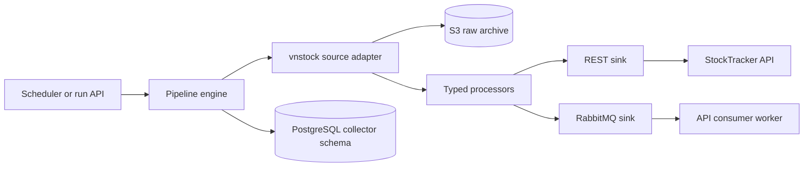

# DataCollector architecture

## Responsibilities

DataCollector owns source integration and pipeline execution. It does not own business entities in the main database. The API owns normalized application records; the collector owns operational metadata in the PostgreSQL `collector` schema and raw provider payloads in object storage.

## Layering

- `plugins/sources`: provider adapters and source-specific capability handling.
- `plugins/processors`: schema validation, normalization, IDs, units, and chunking.
- `plugins/sinks`: authenticated REST and persistent RabbitMQ delivery.
- `pipelines`: orchestration for listing, company, and market data workflows.
- `engine`: scheduling, rate limiting, retries, background job tracking, and pipeline state.
- `control`: PostgreSQL run, step, heartbeat, advisory lock, watermark, and manifest access.
- `archive`: immutable gzip JSON envelopes and checksum-verified replay.

## Pipeline lifecycle

1. An API request or schedule selects a pipeline and creates a run ID.
2. The engine obtains a local process lock and a PostgreSQL advisory lock for the pipeline name.
3. The run is persisted and a heartbeat task starts.
4. Each source operation is recorded as a step. Completed parent steps can be skipped during resume.
5. A valid provider response is archived before transformation. The envelope includes run, pipeline, operation, source, parameters, capture time, payload format, and schema version.
6. Processors reject missing required columns, invalid timestamps, non-finite values, negative values where forbidden, and unsafe empty snapshots.
7. REST sinks use Keycloak client credentials. Market data is published as persistent AMQP messages with publisher confirms.
8. A watermark advances only after the sink confirms success. Source or sink failure preserves the previous cursor.
9. The run finishes as completed, failed, cancelled, or abandoned. Startup recovery marks stale running records abandoned.

## Concurrency and memory

PipelineEngine prevents duplicate work within one process. PostgreSQL advisory locks prevent the same pipeline from running concurrently across collector instances. API-submitted jobs are retained in memory only up to `JOB_HISTORY_LIMIT`; durable run history remains available from PostgreSQL.

APScheduler remains in the web process and is suitable for the local lab. Kubernetes CronJob, EventBridge Scheduler, or another external scheduler should own durable production schedules. Advisory locks remain useful as a second concurrency barrier.

## Data safety rules

- Empty, partial, or schema-invalid listing snapshots never trigger destructive reconciliation.
- Provider IDs are namespaced; deterministic fallback IDs use stable business keys.
- Missing optional fields remain absent rather than becoming zero, an epoch, or an empty deletion request.
- News and events use append/upsert semantics because provider windows may be incomplete.
- Daily, weekly, and monthly candle timestamps are normalized to stable local period keys.
- Equity prices use the units returned by vnstock, currently thousands of VND for the tested providers.
- Delivery is at least once. Database uniqueness and idempotent sinks are required; exactly-once delivery is not claimed.

## Health and observability

`/health/live` reports process liveness. `/health/ready` verifies the HTTP client, control database, and raw archive when enabled. `/metrics` reports HTTP traffic, run states, duration, and latest successful pipeline time. Logs include pipeline and run identifiers and are suitable for Loki ingestion.

## Current boundaries

The pinned public vnstock package is an external dependency with changing schemas and provider availability. Thread-based SDK calls cannot be forcibly stopped after cancellation. The RabbitMQ path has no local outbox, and the raw archive local profile uses S3Mock. Production work still includes managed object storage, encryption and lifecycle rules, a durable scheduler, complete data quality reports, PITR, and load or chaos measurements.
